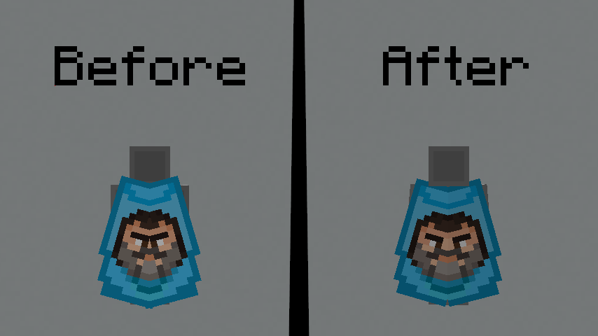
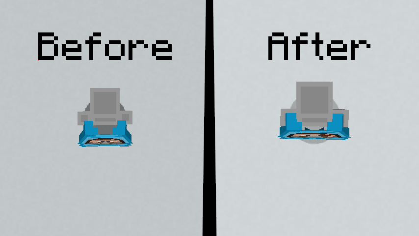
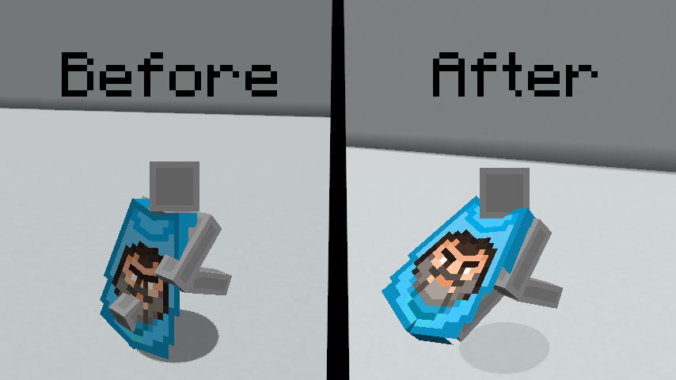

# Better Elytra Render

---

This mod aims to improve the look of elytra in three different ways.

The two parts of the elytra are now slightly further apart, making elytra with cape texture look better (especially with the "Jack Black" capes).

Elytra are now closer to your body. Previously, they looked like they were floating behind you.

When you run, the elytra are raised like capes, preventing your arms from clipping through the texture.

